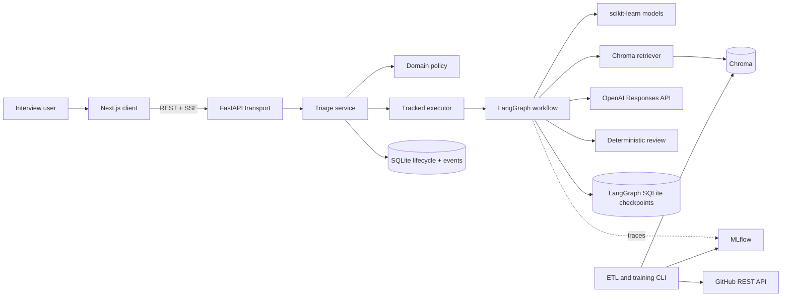
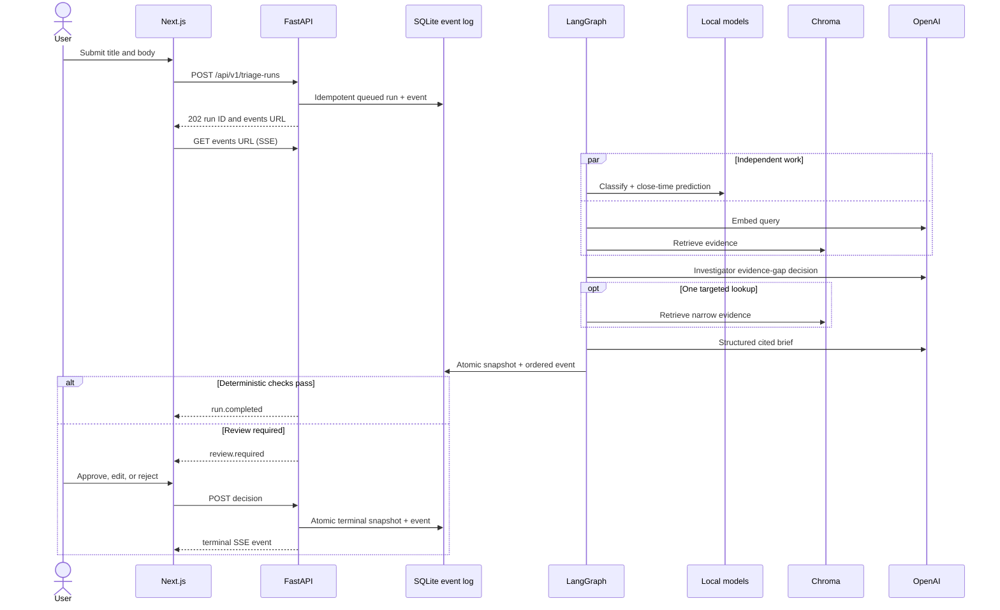

# RepoMedic architecture

## Purpose

RepoMedic demonstrates one complete issue-triage workflow for `scikit-learn/scikit-learn`. It is a modular monolith: browser presentation, FastAPI transport, application lifecycle, LangGraph workflow, and local adapters have explicit boundaries without deployment-time microservices.

## System graph



Browser calls FastAPI directly through `NEXT_PUBLIC_API_BASE_URL`. No Next route handlers, server actions, rewrite proxy, BFF, Redis, external worker, or hidden internal HTTP hop exists.

## Online sequence



Normal path spends two browser requests: creation POST plus persistent SSE. Review adds one decision POST. Browser never polls. SSE IDs increase per run; reconnecting clients send `Last-Event-ID`, and API replays persisted events after that sequence.

## Boundaries and ownership

| Boundary | Owns | Does not own |
| --- | --- | --- |
| Domain | Legal snapshots, decisions, citations, review thresholds | SQL, HTTP, model calls |
| Application | Create, execute, decide, tracked tasks | Vendor parsing |
| LangGraph | Parallel prediction/retrieval and bounded agent order | Public lifecycle |
| SQLite repository | Idempotency, public snapshots, decisions, atomic ordered events | Graph checkpoints |
| LangGraph saver | Live-mode execution checkpoints | Public API state |
| Adapters | GitHub, sklearn, Chroma, OpenAI, MLflow boundary parsing | Cross-workflow policy |
| FastAPI | Validation, REST status, SSE replay, CORS, OpenAPI | Triage rules |
| Next.js | Presentation and local reducer | Backend routing or business logic |

Public run state is a discriminated union:

```text
queued -> running -> completed
queued -> running -> awaiting_review -> completed
awaiting_review -> rejected
queued | running | awaiting_review -> failed
```

Snapshot and corresponding lifecycle event commit in one SQLite transaction. This prevents a terminal snapshot from racing ahead of its terminal SSE event.

## Live and demo modes

`REPOMEDIC_MODE=demo` runs deterministic adapters through the real LangGraph, persistence, API, and UI. It uses no network or secret. `live` swaps only external ports: saved sklearn artifact, OpenAI embedding cache, persistent Chroma, two structured OpenAI roles, and `AsyncSqliteSaver`. Domain and public contracts remain unchanged.

## Deliberate exclusions

No auth, TanStack Query, charts, arbitrary repository onboarding, GitHub writes, cloud, Kubernetes, Postgres, Redis, external queue, or knowledge graph. Clerk, Query, and Charts remain bonuses after core interview proof is stable.
